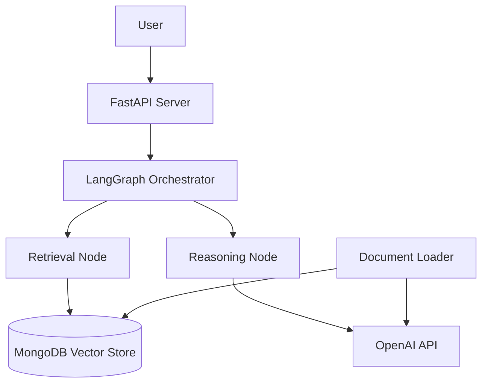

# Design Document

## Overview

The MongoDB Chatbot System is a Python-based application that provides intelligent question-answering capabilities using document retrieval and AI-powered response generation. The system leverages LangGraph for workflow orchestration, MongoDB Atlas Vector Search for document storage and retrieval, and FastAPI for the REST API interface.

The architecture follows a modular design with clear separation of concerns: API layer for user interaction, LangGraph orchestration for workflow management, MongoDB for data persistence, and OpenAI for embeddings and language model capabilities.

## Architecture

### High-Level Architecture



### System Components

1. **API Layer (FastAPI)**
   - Handles HTTP requests and responses
   - Input validation and error handling
   - Request/response logging
   - CORS configuration for web clients

2. **Orchestration Layer (LangGraph)**
   - Manages workflow execution
   - Coordinates between retrieval and reasoning
   - Error handling and retry logic
   - State management between nodes

3. **Data Layer (MongoDB)**
   - Document storage with vector embeddings
   - Atlas Vector Search for similarity queries
   - Metadata and content indexing
   - Connection pooling and optimization

4. **AI Layer (OpenAI)**
   - Text embedding generation
   - Response generation using GPT models
   - Token management and rate limiting

## Components and Interfaces

### Project Structure

```
mongodb-chatbot/
├── src/
│   ├── __init__.py
│   ├── api/
│   │   ├── __init__.py
│   │   ├── main.py              # FastAPI app initialization
│   │   ├── routes/
│   │   │   ├── __init__.py
│   │   │   └── chat.py          # Chat endpoint implementation
│   │   └── models/
│   │       ├── __init__.py
│   │       ├── request.py       # Request/response models
│   │       └── response.py
│   ├── core/
│   │   ├── __init__.py
│   │   ├── config.py            # Configuration management
│   │   └── logging.py           # Logging setup
│   ├── graph/
│   │   ├── __init__.py
│   │   ├── workflow.py          # LangGraph workflow definition
│   │   └── state.py             # Graph state models
│   ├── nodes/
│   │   ├── __init__.py
│   │   ├── retrieval.py         # Document retrieval node
│   │   └── reasoning.py         # Response generation node
│   ├── tools/
│   │   ├── __init__.py
│   │   ├── embeddings.py        # Embedding utilities
│   │   ├── vector_store.py      # MongoDB vector store interface
│   │   └── text_processing.py   # Text chunking and processing
│   └── database/
│       ├── __init__.py
│       ├── connection.py        # MongoDB connection management
│       └── operations.py        # Database operations
├── scripts/
│   ├── __init__.py
│   └── load_docs.py             # Document loading script
├── tests/
│   ├── __init__.py
│   ├── test_api.py
│   ├── test_nodes.py
│   └── test_tools.py
├── requirements.txt
├── .env.example
├── README.md
└── main.py                      # Application entry point
```

### Core Interfaces

#### API Models

```python
# Request Model
class ChatRequest(BaseModel):
    question: str
    session_id: Optional[str] = None
    max_tokens: Optional[int] = 1000

# Response Model
class ChatResponse(BaseModel):
    answer: str
    sources: List[str]
    session_id: str
    processing_time: float
```

#### Graph State

```python
class GraphState(TypedDict):
    question: str
    retrieved_docs: List[Document]
    context: str
    answer: str
    sources: List[str]
    session_id: str
```

#### Vector Store Interface

```python
class MongoVectorStore:
    def similarity_search(self, query: str, k: int = 5) -> List[Document]
    def add_documents(self, documents: List[Document]) -> None
    def create_index(self) -> None
```

## Data Models

### Document Schema

```python
{
    "_id": ObjectId,
    "content": str,           # Original document text
    "embedding": List[float], # Vector embedding
    "metadata": {
        "source": str,        # File path/name
        "chunk_id": int,      # Chunk number
        "created_at": datetime,
        "file_type": str      # pdf, txt, etc.
    },
    "text_length": int,
    "chunk_index": int
}
```

### MongoDB Collections

1. **documents**: Stores document chunks with embeddings
2. **sessions**: Stores conversation sessions (optional for context)
3. **logs**: Stores API request/response logs

### Vector Search Index

```javascript
{
  "fields": [
    {
      "type": "vector",
      "path": "embedding",
      "numDimensions": 3072,  // text-embedding-3-large dimensions
      "similarity": "cosine"
    },
    {
      "type": "filter",
      "path": "metadata.source"
    }
  ]
}
```

## Error Handling

### API Error Responses

```python
class ErrorResponse(BaseModel):
    error: str
    message: str
    status_code: int
    timestamp: datetime
```

### Error Categories

1. **Validation Errors (400)**
   - Invalid request format
   - Missing required fields
   - Invalid parameter values

2. **Authentication Errors (401)**
   - Invalid API keys
   - Missing authentication

3. **Rate Limit Errors (429)**
   - OpenAI API rate limits
   - MongoDB connection limits

4. **Server Errors (500)**
   - Database connection failures
   - LangGraph execution errors
   - Unexpected exceptions

### Retry Logic

- MongoDB operations: 3 retries with exponential backoff
- OpenAI API calls: 3 retries with exponential backoff
- LangGraph node failures: 2 retries before marking as failed

## Testing Strategy

### Unit Tests

1. **API Layer Tests**
   - Endpoint validation
   - Request/response serialization
   - Error handling scenarios

2. **Node Tests**
   - Retrieval node functionality
   - Reasoning node output validation
   - Error handling in nodes

3. **Tool Tests**
   - Embedding generation
   - Vector store operations
   - Text processing utilities

### Integration Tests

1. **End-to-End API Tests**
   - Complete chat flow testing
   - Database integration testing
   - LangGraph workflow testing

2. **Database Tests**
   - MongoDB connection testing
   - Vector search functionality
   - Document loading and retrieval

### Performance Tests

1. **Load Testing**
   - Concurrent request handling
   - Response time benchmarks
   - Memory usage monitoring

2. **Vector Search Performance**
   - Query response times
   - Embedding generation speed
   - Index optimization validation

### Configuration Management

Environment variables required:

```bash
# MongoDB Configuration
MONGODB_URI=mongodb+srv://...
MONGODB_DATABASE=chatbot_db
MONGODB_COLLECTION=documents

# OpenAI Configuration
OPENAI_API_KEY=sk-...
EMBEDDING_MODEL=text-embedding-3-large
CHAT_MODEL=gpt-4

# API Configuration
API_HOST=0.0.0.0
API_PORT=8000
LOG_LEVEL=INFO

# Vector Search Configuration
VECTOR_INDEX_NAME=vector_index
SIMILARITY_THRESHOLD=0.7
MAX_RETRIEVED_DOCS=5
```

### Deployment Considerations

1. **Docker Support**
   - Containerized application
   - Multi-stage builds for optimization
   - Health check endpoints

2. **Monitoring**
   - Request/response logging
   - Performance metrics
   - Error tracking and alerting

3. **Scalability**
   - Horizontal scaling support
   - Connection pooling
   - Caching strategies for embeddings